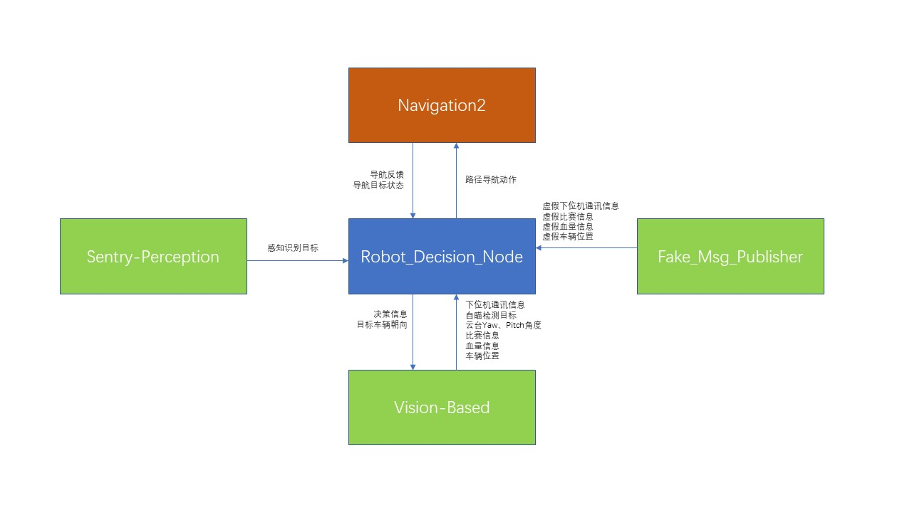
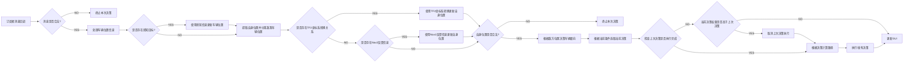
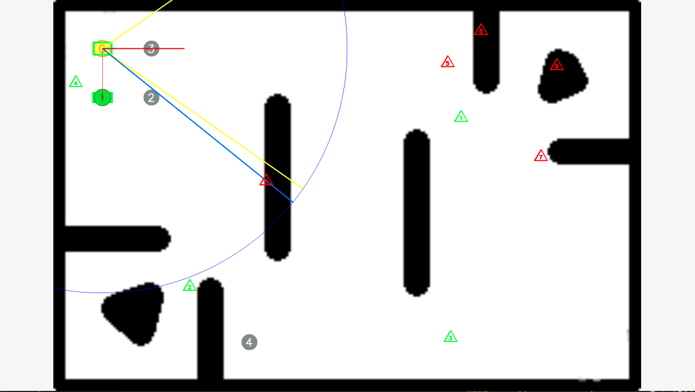

# JsonFileBased_RobotDecision

基于Json文件解析的行为树，为机器人宏观决策设计

基于Json文件的机器人决策系统（JsonFileBased RobotDecision），为RoboMaster参赛机器人宏观决策设计。通过修改指定Json文件，快速修改机器人运行逻辑并约束移动区域，提供高自由度、高定制化的机器人决策逻辑定制功能。带有可视化GUI，可直观查看机器人决策状态。另有虚假消息发布者，以模拟虚拟环境来提供离线调试功能。程序运行在ROS2(Robot Operating System 2) Galactic框架下。

# Version：1.2a

# **节点（Node） 介绍：**

## robot_decision:

ros2 run robot_decision robot_decision_node

### 订阅：

| 话题                                    | 消息                                                           | 描述                  |
| --------------------------------------- | -------------------------------------------------------------- | --------------------- |
| /obj_hp                                 | global_interface::msg::ObjHP                                   | 场上兵种/设施血量     |
| /car_pos                                | global_interface::msg::CarPos                                  | 场上各兵种位置        |
| /game_info                              | global_interface::msg::GameInfo                                | 比赛相关信息          |
| /serial_msg                             | global_interface::msg::Serial                                  | 车辆模式、弹速等信息  |
| /joint_states                           | sensor_msgs::msg::JointState                                   | 云台yaw、pitch轴角度  |
| perception_detector/perception_array    | global_interface::msg::DetectionArray                          | 感知识别信息          |
| navigate_through_poses/_action/feedback | nav2_msgs::action::NavigateThroughPoses::Impl::FeedbackMessage | Nav2 Action反馈信息   |
| navigate_through_poses/_action/status   | action_msgs::msg::GoalStatusArray                              | Nav2 Action Goal 状态 |
| /armor_detector/armor_msg               | global_interface::msg::Autoaim                                 | 自瞄检测信息          |

### 发布：

| 话题                    | 消息                            | 描述             |
| ----------------------- | ------------------------------- | ---------------- |
| robot_decision/aim_yaw  | std_msgs::msg::Float32          | 车辆目标朝向偏角 |
| robot_decision/decision | global_interface::msg::Decision | 车辆当前决策信息 |

### 动作:

| Name                   | Action                                  | 描述                 |
| ---------------------- | --------------------------------------- | -------------------- |
| navigate_through_poses | nav2_msgs::action::NavigateThroughPoses | 发送Nav2路径导航动作 |

### 参数：

| Name               | 类型  | 描述                 |
| ------------------ | ----- | -------------------- |
| distance_thr       | float | 路径点计算距离阈值   |
| seek_thr           | float | 感知索敌距离阈值     |
| IsRed              | bool  | 红蓝方标志位         |
| IfShowUI           | bool  | 是否显示可视化GUI    |
| SelfIndex          | int   | 车辆自身ID（索引）   |
| friendOutPostIndex | int   | 我方前哨站ID（索引） |

## fake_msg_publisher:

ros2 run fake_msg_publisher fake_msg_publisher_node

### 发布：

| 话题        | 消息                            | 描述                 |
| ----------- | ------------------------------- | -------------------- |
| /obj_hp     | global_interface::msg::ObjHP    | 场上兵种/设施血量    |
| /car_pos    | global_interface::msg::CarPos   | 场上各兵种位置       |
| /game_info  | global_interface::msg::GameInfo | 比赛相关信息         |
| /serial_msg | global_interface::msg::Serial   | 车辆模式、弹速等信息 |

# 节点关系图

# 项目结构 （OUT-OF-DATA）

├── images		//图片目录
├── LICENSE		//开源协议
├── README.md	//项目自述文件
└── src			//项目源码目录
    ├── fake_msg_publisher							//假消息发布者功能包目录
    │   ├── fake_msg_publisher
    │   │   ├── fake_msg_publisher_node.py			//节点源码
    │   │   ├── init.py
    │   │   └── pycache								//python缓存
    │   │       ├── fake_msg_publisher_node.cpython-38.pyc
    │   │       └── init.cpython-38.pyc
    │   ├── package.xml								//功能包依赖xml文件
    │   ├── resource								//功能包资源文件
    │   │   └── fake_msg_publisher
    │   ├── setup.cfg									//ROS2 setup.cfg
    │   ├── setup.py									//ROS2 setup.py
    │   └── test
    │       ├── test_copyright.py
    │       ├── test_flake8.py
    │       └── test_pep257.py
    ├── global_interface			//定义全局通用消息文件
    │   ├── CMakeLists.txt			//功能包CMakeLists.txt
    │   ├── msg					    //消息目录
    │   │   ├── CarPos.msg			//车辆位置消息
    │   │   ├── Decision.msg		//决策消息
    │   │   ├── DetectionArray.msg	//感知识别消息
    │   │   ├── Detection.msg		//自瞄识别消息
    │   │   ├── GameInfo.msg		//比赛信息消息
    │   │   ├── ObjHP.msg			//血量消息
    │   │   ├── Point2f.msg			//2D点消息
    │   │   └── Serial.msg			//下位机通讯消息
    │   └── package.xml			    //功能包依赖xml文件
    └── robot_decision				//决策功能包
    ├── CMakeLists.txt				//功能包CMakeLists.txt
    ├── include					    //头文件目录
    │   ├── Json					//Json处理库头文件
    │   │   ├── json-forwards.h
    │   │   └── json.h
    │   ├── robot_decision			//决策系统头文件目录
    │   │   ├── configs.h			//决策系统固定参数设定文件
    │   │   ├── public.h			//公共头文件
    │   │   ├── RobotDecision.h		//决策系统头文件
    │   │   └── structs.h			//结构体定义
    │   └── robot_decision_node.hpp	//决策节点头文件
    ├── launch					    //launch目录
    │   └── decision_node_launch.py	//带参数节点启动launch文件
    ├── package.xml				    //功能包依赖xml文件
    ├── resources					//资源目录
    │   └── RMUL.png				//RMUL赛场障碍图
    ├── sample					    //Json样例目录
    │   ├── decisions.json			//决策Json样例
    │   └── waypoints.json			//路径点Json样例
    └── src						    //源码目录
    ├── Json					    //Json处理库源码
    │   └── jsoncpp.cpp
    ├── robot_decision			    //决策系统源码
    │   └── RobotDecision.cpp
    └── robot_decision_node.cpp	    //决策节点源码

# 决策主要流程图

程序采用时间相近协议同步接收 /obj_hp 、/car_pos 、/game_info 、/serial_msg 话题的消息，异步接收 /joint_states 、 perception_detector/perception_array 、navigate_through_poses/_action/feedback 、 navigate_through_poses/_action/status的消息，每次回调固定处理车辆朝向和目标决策。

决策由车辆当前位置、车辆当前模式、当前比赛时间、己方前哨站当前血量、己方车辆位置、敌方车辆位置共同决定，在有多个决策符合条件的情况下，取权重最高的决策。

机器人移动路径点由决策给出，分为直达和连续两种情况。直达情况下，直接给出最终路径点，连续情况下，由图深度优先搜索算法计算一系列连续路径点，可适当缓解Nav2导航问题。

车辆朝向由敌方车辆位置决定，通过计算索敌圈内最近敌人方位，得出视野外敌方角度，被障碍遮挡但仍被检测到的敌方位置通过间段采样的方法滤除。

# GUI

GUI可直观显示车辆当前状态、路径点、决策状态、敌我位置与索敌情况。路径点分为当前、符合条件但未被选择、符合条件且被选择和不符合条件四种状态。路径点上的敌我接近情况也被显示。（PS：图上敌我位置由虚假消息发布者随机给出）

# 模板

## 决策：

{

    "data" : [

    {

    "id" : 0,				//决策ID

    "name" : "test1",			//决策命名

    "wayPointID" : [-1],		//决策所属路径点，填写多个时，只要当前路径点在列表内，便通过判断，-1不作判断

    "weight" : 500,			//决策权重，符合条件的决策中优先取权重大的，大权重决策可覆盖正在执行的决策

    "start_time" : -1,			//决策容许时间范围起始，-1不作判断

    "end_time" : 420,		//决策容许时间范围结束，-1不作判断

    "robot_mode" : 0,		//当前机器人模式，-1不作判断

    "minHP" : -1,			//决策容许血量范围起始，-1不作判断

    "maxHP" : -1,			//决策容许血量范围结束，-1不作判断

    "decide_mode" : 0,		//决策决定机器人模式[6：正常巡航，7：扭腰巡航，8：自瞄]

    "decide_wayPoint" : 0,		//决策决定目标路径点（id）

    "out_post_HP_min": 0,		//决策容许前哨站血量线，-1不作判断

    "if_succession" : false,		//决策路径是否连续，否为直达

    "if_reverse" : true,		//是否返程

    "enemyPosition" : [[-1],[-1],[-1],[-1],[-1],[-1]],	//敌方车辆当前路径点ID，填写多个时，只要目标单位所在路径点在列表内，便通过判断，-1不作判断 顺序： 英雄 工程 3，4，5步兵，哨兵（UNTESTED）

    "friendPosition" : [[-1],[-1],[-1],[-1],[-1],[-1]]	//友方车辆当前路径点ID，填写多个时，只要目标单位所在路径点在列表内，便通过判断，-1不作判断 顺序： 英雄 工程 3，4，5步兵，哨兵（UNTESTED）

    },

    ...

    ]

}

## 路径点：

{

    "data": [

    {

    "id": 0,				//路径点ID

    "name": "test1",		//路径点命名

    "type": 0,			    //路径点类型（UNUSED）

    "x": 1.0,			    //路径点坐标x（真实坐标）

    "y": 1.0,			    //路径点坐标y（真实坐标）

    "angle": 0.0,		    //路径点上车辆朝向（弧度制）（UNTESTED）

    "connect": [			   //路径点邻接表（配合决策if_succession使用）

    1

    ],

    "enemyWeights": [	    //路径点上敌方选择权重，-1不作判断（UNUSED）

    -1,

    -1,

    -1,

    -1,

    -1

    ]

    },

    ...

    ]

}

## CONFIG 配置文件：

"Debug" : false,						//是否Debug（UNUSED）

"WayPointsPATH" : "waypoints.json",		//shared/JsonFile文件夹下路径点文件命名

"DecisionsPATH" : "decisions.json",			//shared/JsonFile文件夹下决策文件命名

"MAP_PATH" : "RMUL.png",				//shared/resources文件夹下map命名

"REAL_WIDTH" : 12.0,					//场地真实宽度

"REAL_HEIGHT": 8.0,					//场地真实高度

"GOAL_TIME_THR_SEC" : 2,				//目标执行时间阈值（UNUSED）

"TIME_THR" : 1,						//消息有效时间（秒）

"CAR_SEEK_FOV" : 70.0,					//车辆自瞄FOV

"INIT_DISTANCE_THR" : 1.0,				//路径点判断用距离阈值（米）

"INIT_SEEK_THR" : 5.0,					//索敌圈半径（米）

"INIT_ISBLUE" : false,					//红蓝方判断标志位 *赛前修改  ！important*

"INIT_IFSHOWUI" : true,					//是否显示UI

"INIT_SELFINDEX" : 5,					//车辆当前索引（0-5）[英雄 工程 3，4，5步兵 哨兵]

"INIT_FRIENDOUTPOSTINDEX" : 6,			//前哨站当前索引（0-7）[英雄 工程 3，4，5步兵 哨兵 前哨站 基地]

"INIT_FRIENDBASEINDEX" : 7,				//基地当前索引（0-7）[英雄 工程 3，4，5步兵 哨兵 前哨站 基地]

"STEP_DISTANCE" : 0.1,					//障碍判断步进（米）

"GAME_TIME" : 420						//比赛持续时间（秒）

## 决策、路径点文件编写注意事项：

1.对于红蓝方，路径点文件应编写两个以适应场地换向

2.不论决策还是路径点文件，决策与路径点的ID应唯一

3.应尽量少的使用-1来跳过判断，避免出现意料外的情况

4.决策中，决策所属路径点与目标路径点一致时可达成原地驻留的效果

5.血量区间与时间区间应尽量减少重合

6.同一执行级别下的决策权重应保持一致
